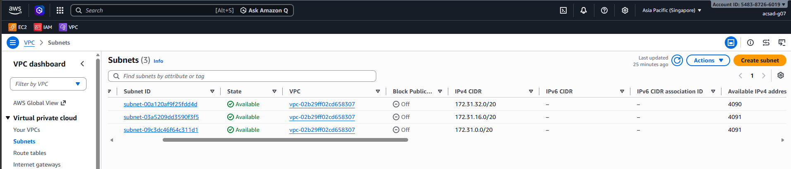
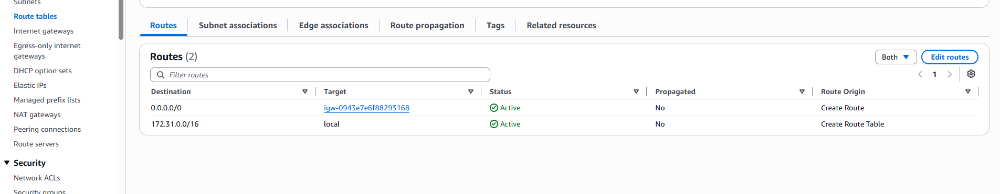
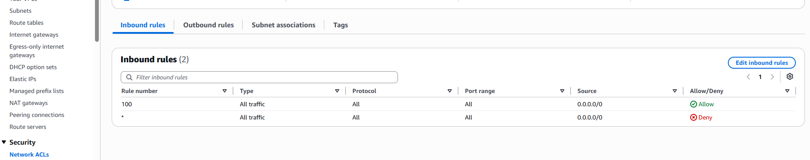
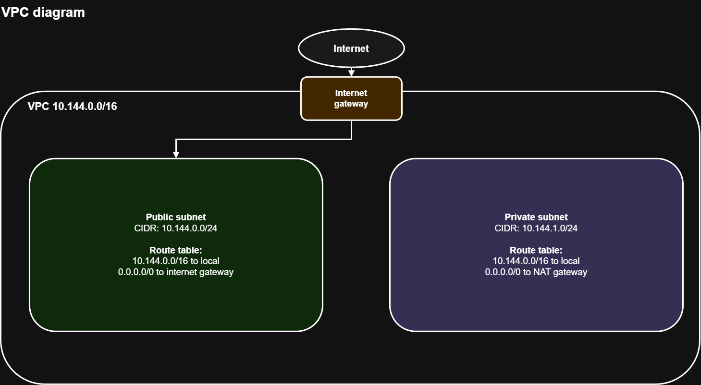

# Assignment 2 Submission

<!--
How to use this template:

1. Copy this file to submissions/assignment-2/<your-github-username>/submission.md
2. Replace every answer placeholder with your own answer. Delete the angle brackets too.
3. Save your four images in the same folder, with the exact file names below.
4. Do not write your full name or your student number in this file.
-->

## About me

- GitHub username: Nomicon18
- Section: 4-ACSAD
- IAM user name that I signed in with: acsad-g07
- X: 144

---

## Part A. Explore

### A1. The VPC

Default VPC IPv4 CIDR:

172.31.0.0/16

Number of addresses in that CIDR:

65,536

### A2. The subnets

### A2. The subnets

| Availability Zone | IPv4 CIDR |
|---|---|
| ap-southeast-1a | 172.31.32.0/20 |
| ap-southeast-1b | 172.31.16.0/20 |
| ap-southeast-1c | 172.31.0.0/20 |

Screenshot 1. Save it as `screenshot-1-subnets.png` in your folder. The image line below shows it.

### A3. Available addresses

Available IPv4 addresses in each subnet:

- ap-southeast-1a (172.31.32.0/20): 4090
- ap-southeast-1b (172.31.16.0/20): 4091
- ap-southeast-1c (172.31.0.0/20): 4091

Why is the number lower than 4,096?

AWS reserves five IPv4 addresses in every subnet for networking purposes, so a /20 subnet with 4,096 total addresses normally has 4,091 available addresses.

What uses the missing address in the subnet with the lowest number?

The additional missing address is being used by an AWS resource, most likely the Lab 2 EC2 instance through its network interface and private IPv4 address.

### A4. The route table

| Destination | Target |
| --- | --- |
| `0.0.0.0/0` | `igw-0943e7e6f88293168` |
| `172.31.0.0/16` | `local` |

Screenshot 2. Save it as `screenshot-2-routes.png` in your folder. The image line below shows it.

### A5. Public or private

Are the default subnets public or private? Which route proves it?

the default subents are public because it contains a route table that has route '0.0.0.0/0' in the igw

### A6. The internet gateway

State of the internet gateway:

attached

What happens to the default subnets if the gateway is detached?

without the igw, the public subnets internet route no longer have working gateway.

### A7. NAT gateways

Number of NAT gateways:

0

Can a server in a new private subnet download updates? Why?

No. A server in a new private subnet cannot download updates from the internet because there is no NAT gateway to provide outbound internet access for the private subnet.

### A8. The network ACL

| Rule number | Source | Allow/Deny |
|---|---|---|
| 100 | 0.0.0.0/0 | Allow |
| * | 0.0.0.0/0 | Deny |

How is a network ACL different from a security group?

A network ACL controls traffic at the subnet level and is stateless, so inbound and outbound rules are evaluated separately. A security group controls traffic for individual resources such as EC2 instances and is stateful, so return traffic is automatically allowed for permitted connections.

Screenshot 3. Save it as `screenshot-3-network-acl.png` in your folder. The image line below shows it.

### A9. The default security group

Inbound rule (type and source):

Type: All traffic  
Source: sg-0c5b6d4081cf0a534

Which resources can send traffic to an instance that uses it?

Only resources that also use the same default security group can send traffic to an instance using this security group.

---

## Part B. Prepare

### B1. Plan two subnets

- Public subnet CIDR: 10.144.0.0/24
- Private subnet CIDR: 10.144.0.0/24

### B2. Route tables

Route table of the public subnet:

| Destination | Target |
| --- | --- |
| 10.144.0.0/16 | local |
| 0.0.0.0/0 | internet gateway |

Route table of the private subnet:

| Destination | Target |
| --- | --- |
| 10.144.0.0/16 | local |
| 0.0.0.0/0 | NAT gateway |

### B3. My VPC diagram

Tool used (Excalidraw, draw.io, Lucidchart, or paper):

draw.io

Save your diagram as `vpc-diagram.png` in your folder. The image line below shows it.

### B4. Predict a change

Can you still open the instance web page from your laptop? Why?

No. If the `0.0.0.0/0` route is removed from the default route table, the instance will no longer have a route to the Internet Gateway.

Can the instance still reach another instance in the same VPC? Why?

Yes. Instances in the same VPC can still communicate using the `local` route for `10.144.0.0/16`, even if the internet route is removed.

### B5. Place a database

Which subnet gets the database? Why?

I would place the database server in the private subnet because it should not be directly exposed to the public internet.its still can communicate to the vps but now has protection

### B6. My question about VPCs

What is your question, and what made you think of it?

### B6. Your question about VPCs

How can I securely connect to an EC2 instance in a private subnet if it does not have a public IP address?

I thought of this because private subnets are more secure, but Im curious how can the admin still access and manage servers inside.
